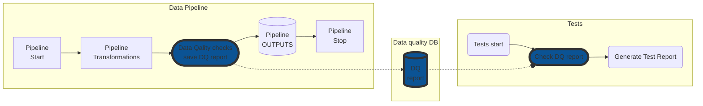
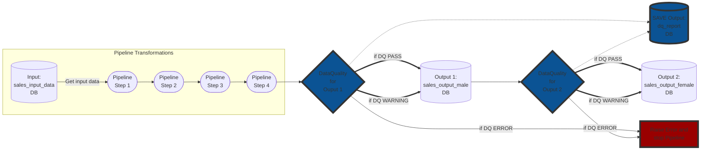

This project was created as an example to show one more way to use [great expectation](https://docs.greatexpectations.io/docs/) library and integration for the Data quality checks into the pipeline. 
The main idea is to create a universal way to integrate Data Quality control into pipeline projects based on the most of Data Pipeline frameworks. 
This approach can be applied for Data Pipeline project which use spark and  pandas data frames.

+ The work with this project is in progress still...


## Advantages and disadvantages of this approach 
(when compared with the standard approach that offers great_expectation community)

### pros:
- Unified approach to most of the Data Pipelines
- Easy-to-Understand Integration (Especially for QA Engineer)
- Ability to create a unified approach for the QA Automation engineer
- Easy to debug and save reports both to files and Database
- All work with quality does not go beyond the boundaries of its directory which means all data quality related files are stored in one place oppose to current situation when GE files that are getting into various areas of pipeline
-  __Ability to create custom expectations without the Great Expectation library__

### cons:
- This approach is non-standard and there may be issues that I did not foresee.
- I doubt that it is possible to add custom expectations for the `great_expectations` library with this approach (but we can use your own expectations using any libraries and tools)

## The main idea for a complete pipeline cycle including test run:
###### This scheme is related to current Project only, the Data Quality checks can be integrated in defferent places inside the Data Pipeline


As shown in the diagram above, the Data Quality checks are integrated inside the Data Pipeline, 
and produce a report of the DQ checks performed, whether they are successful or not.
Tests, in turn, run independently from the Data Pipeline and check the DQ report (The DQ report can be saved to DB on in the csv file)

## Installation
1. Install Spark 
2. Use `python 3.7+`
3. Install the dependencies from the requiremets.txt
```sh
pip install requirements.txt
```  
4. Install Allure report (test report):
- Mac OS:
```bash
brew install allure
```
- Linux
```bash
sudo apt-add-repository ppa:qameta/allure
sudo apt-get update 
sudo apt-get install allure
```
- Windows
```bash
scoop install allure
\bin\checkver.ps1 allure -u
scoop update allure
```


### Run pipeline Spark
```bash
python3 main_spark.py
```
### Run pipeline Pandas
```bash
python3 main_pandas.py
```
### Run tests and generate report
```bash
pytest test_example.py --alluredir=allurereport

```
At the same time full pipeline (Data Pipeline, Data Quality, tests) can be run in one line:
```bash
python3 main_spark.py ; pytest test_example.py --alluredir=allurereport

```
### generate Allure html report locally:
```bash
allure serve allurereport
```


## Project Tree
```
├── README.md
├── data
│   └── sales_pipeline.db
├── data_quality
│   ├── dq_report.csv
│   ├── dq_female_output.py
│   ├── dq_male_output.py
│   └── data_quality_core.py
├── main_pandas.py
├── main_spark.py
├── test_example.py
└── requirements.txt
```
`main_spark.py`and `main_pandas.py`
This files include example of the Data Pipeline and Entry Point of the project. This is a very simple example of a Data Pipeline based on Spark and Pandas separately, but it should be enough to show the integration of Data Quality. </br> Both examples of pipelines include:
- One inputs DB data (`sales_input_data`)
- 4 Pipeline steps
- Two outputs DB data (`sales_output_female` and `sales_output_male`)

#### Entry point:
```
f __name__ == '__main__':
    sales = SalesDataPipeline()
    ...
```
#### Pipeline Steps:

```python
    # pipeline step 1
    male_df = sales.get_sales_separated_by_gender(gender="Male")
    female_df = sales.get_sales_separated_by_gender(gender="Female")

    # pipeline step 2
    male_df = sales.get_sales_by_payment_method(df=male_df, payment_method="Credit card")
    female_df = sales.get_sales_by_payment_method(df=female_df, payment_method="Credit card")

    # pipeline step 3
    male_df = sales.get_sales_price_lower_then(df=male_df, price_lower=50)
    female_df = sales.get_sales_price_lower_then(df=female_df, price_lower=50)

    # pipeline step 4
    male_df = sales.get_sales_quantity_lower_then(df=male_df, quantity_lower=3)
    female_df = sales.get_sales_quantity_lower_then(df=female_df, quantity_lower=3)
```
#### Data Quality Checks for MALE and FEMALE Data frames:
```python
# DATA QUALITY - Data Frame 1 (for male df)
sales.data_quality_checks_sales_pipeline(
    df=male_df,
    table_name="male_output"
)
# DATA QUALITY - Data Frame 2 (for female df)
sales.data_quality_checks_sales_pipeline(
    df=female_df,
    table_name="female_output"
)
```
- Pipeline outputs
```python
# pipeline save output 1
sales.save_output(output_data=male_df, output_table="sales_output_male")
# pipeline save output 2
sales.save_output(output_data=female_df, output_table="sales_output_female")
```
### `data/sales_pipeline.db` sqlite Data Base which include the next tables:
- `sales_input_data` The input data for all pipelines (Spark/Pandas)
- `sales_output_female` The first output of the pipelines
- `sales_output_male` The second output of the pipelines
- `dq_report` The report from the Data Quality checks

### `data_quality/dq_report.csv`
Example of the report for the data quality checks in the csv format. (can be remoced at all)

### `data_quality/data_quality_core.py`
The main file with all the required STANDARD DQ checks for the all pipelines.

1. import required `great_expectations` modules
2. create `great_expectation` data frame from `spark`/`pandas` data frame (`self.df_ge = dataset.SparkDFDataset(self.sales_df)` for spark)

```python
from great_expectations import dataset
from great_expectations.expectations.expectation import ExpectationValidationResult

class SalesPipelineDQ:

    def __init__(self, sales_df, connector=None, cursor=None):
        self.sales_df = sales_df
        if type(self.sales_df) == SparkDataFrame:
            self.df_ge = dataset.SparkDFDataset(self.sales_df)
        elif type(self.sales_df) == pd.DataFrame:
            self.df_ge = dataset.PandasDataset(self.sales_df)

```

3. Create Data Quality function using `great_expectations` Data Frame and add result of test to report `data_quality/dq_report.csv`

```python
def expect_column_to_exist(self, column_name):
    result = self.df_ge.expect_column_to_exist(column_name, result_format='SUMMARY')
    self.add_result_to_report(result, description=f"Expect {column_name} in list of columns of Sales df")
```
Not all expectation can be used for all Data Frame types. That's why we need to add additional checks for all dq methods:
```python
if type(self.df_ge) is not dataset.PandasDataset and type(self.df_ge) is not dataset.SparkDFDataset:
    warnings.warn('\033[33m' + "\nThis expectation is not supported of your dataframe" + '\033[m')
    return
```

`dq_finalize` function is created to raise `error` or `warning` when all DQ checks are completed, based on DQ report
```python
def dq_finalize(self):
    warnings_df: pd.DataFrame = self.dq_report.loc[(self.dq_report['success'].astype(str).str.contains('False')) &
                                                   (self.dq_report['is_error'].astype(str).str.contains('False'))]
    errors_df: pd.DataFrame = self.dq_report.loc[(self.dq_report['success'].astype(str).str.contains('False')) &
                                                 (self.dq_report['is_error'].astype(str).str.contains('True'))]
    if warnings_df.shape[0]:
        warnings.warn(
            '\033[33m' + f"\n{warnings_df.to_json(indent=3, orient='records', lines=True)}" + '\033[m')
    if errors_df.shape[0]:
        raise Exception("'\033[91m'" + f"\n{errors_df.to_json(indent=3, orient='records', lines=True)}" + '\033[m')
```

### `dq_female_output.py`/`dq_male_output.py`
This modules is created to perform DQ Checks for a specific date frame and includes checks related to it only.
Added example of the custom expactation for Spark and Pandas Data Frame (for `dq_male_output.py` only):
- check_male_from_city_unit_price_not_more

Run all checks:
```python
def run_all_core(self):
    self.dq.expect_column_to_exist(
        "payment",
        exception=DqException(
            exception_message="Expect 'payment' column is in list of columns TC345654",
            is_error=False
        )
    )
    self.dq.expect_column_to_exist(
        "unit_price",
        exception=DqException(
            exception_message="Expect 'unit_price' column is in list of columns TC343654",
        )
    )

...


def run_all_custom(self):
    self.check_male_from_city_unit_price_not_more(
        city="Mandalay",
        unit_price_threshold=10,
        exception=DqException(
            exception_message="Expect that 'unit_price' more then 10 if buyer from 'Mandalay' city and is Male"
        )
    )

```


## Data quality and Data pipeline main logic scheme:
###### This scheme is related to current Project only, the Data Quality checks can be integrated in defferent places inside the Data Pipeline


